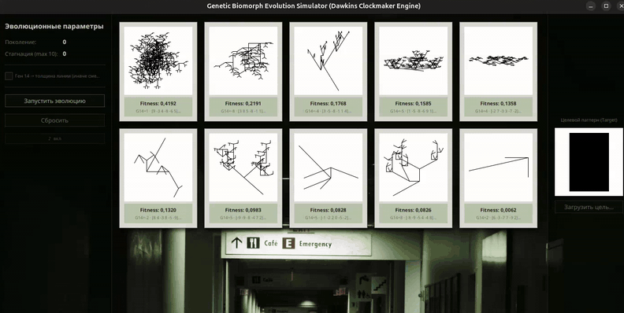

# blind-watchmaker

Email: andrey@brombin.ru
Telegram: [@devbrombin](https://t.me/devbrombin)

---



---

## Содержание

- [Обзор](#обзор)
- [Как работает](#как-работает)
- [Технологии](#технологии)
- [Запуск](#запуск)
- [Управление](#управление)
- [Обратная связь](#обратная-связь)

---

## Обзор

Симулятор эволюции биоморф по модели Ричарда Докинза из «Слепого часовщика». Генетический алгоритм итеративно приближает популяцию симметричных древовидных структур к заданному целевому изображению. Пользователь загружает целевой паттерн, запускает сессию и наблюдает за сходимостью.

Интерфейс оформлен как психиатрический тест Роршаха: карточки с биоморфами на фоне больничного коридора.

---

## Как работает

Каждая биоморфа описывается генотипом из 16 генов (15 управляют геометрией дерева, 16-й — толщиной линии или смещением). Фенотип — рекурсивное дерево, растеризованное в bitmap.

Приспособленность вычисляется через **нормализованную кросс-корреляцию (NCC)** пикселей кандидата и целевого изображения. Поиск оптимума ускоряется **имитацией отжига**: вероятность принятия худшего решения убывает с ростом стагнации.

Популяция (~10 особей) генерируется параллельно через `pmap`. При стагнации больше 8 поколений подряд счётчик краснеет — сигнал о застревании в локальном минимуме.

---

## Технологии

- **Язык:** Clojure 1.12
- **UI:** cljfx (JavaFX 21)
- **Сборка:** Clojure CLI / deps.edn
- **Рантайм:** JDK 21+

---

## Запуск

### Требования

- JDK 21+
- [Clojure CLI](https://clojure.org/guides/install_clojure)

### Установка и запуск

```bash
git clone <repository_url>
cd blind-watchmaker
clojure -M:run
```

---

## Управление

| Действие | Описание |
|---|---|
| Загрузить цель | Выбрать изображение-эталон (PNG/JPEG) |
| Запустить эволюцию | Запустить GA-цикл |
| Пауза / Продолжить | Приостановить и возобновить сессию |
| Сброс | Инициализировать случайную популяцию |
| Ген 14 | Переключить режим: толщина линии или смещение направления |

Клик по карточке выбирает биоморфу как родителя для следующего поколения.

---

## Обратная связь

Telegram: [@devbrombin](https://t.me/devbrombin)

Email: andrey@brombin.ru
